# CraftCove
[live link](https://craftcove.onrender.com)

[Database schema](https://github.com/ranwang0410/CraftCove/wiki/DATABASE-SCHEMA)

# Technologies Used

# Features
- Users can create, edit, and delete shops
- Users can create, edit, and delete products for shop
- Users can create, edit, and delete review for product
- Users can add, edit quantity and delete product to shoppingcart

## Screenshots:

- Landing Page (List of products): 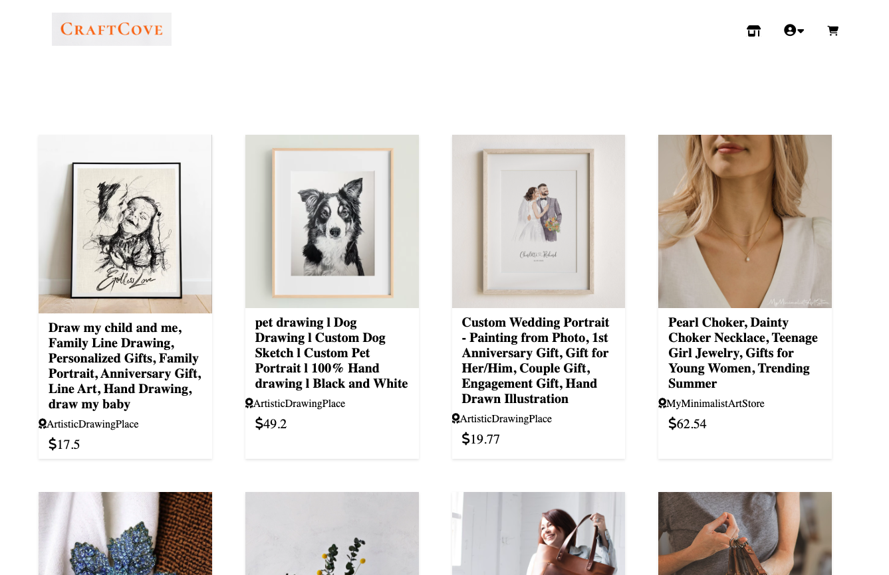
- Log In Modal: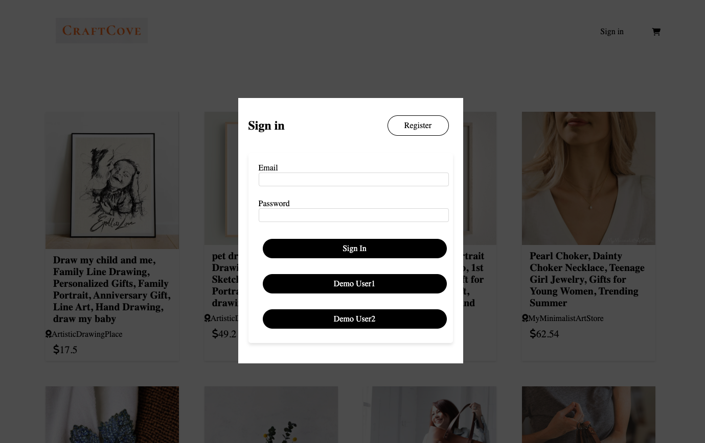
- Sign Up Modal: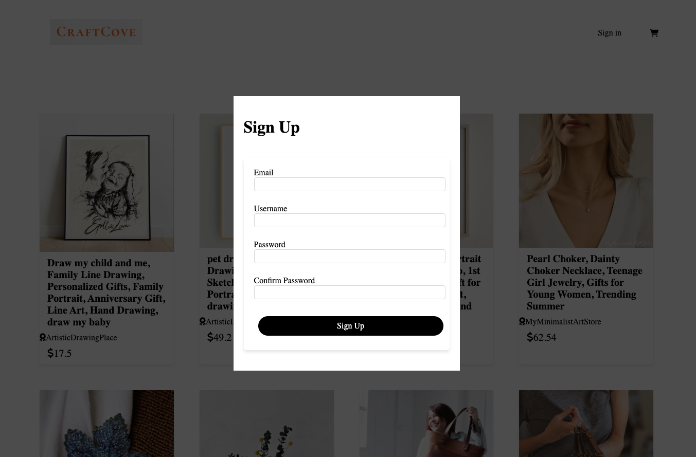
- Product Detail Page: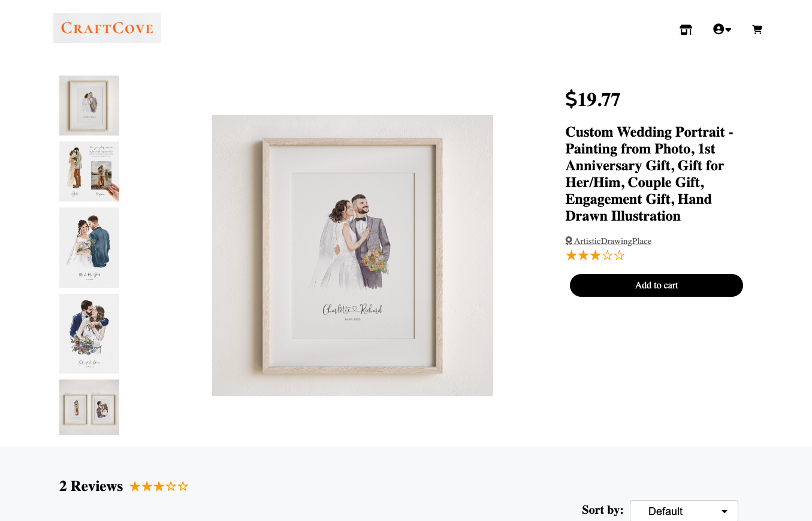 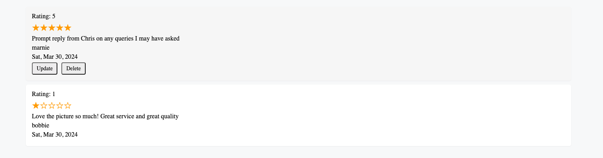
- Create Review: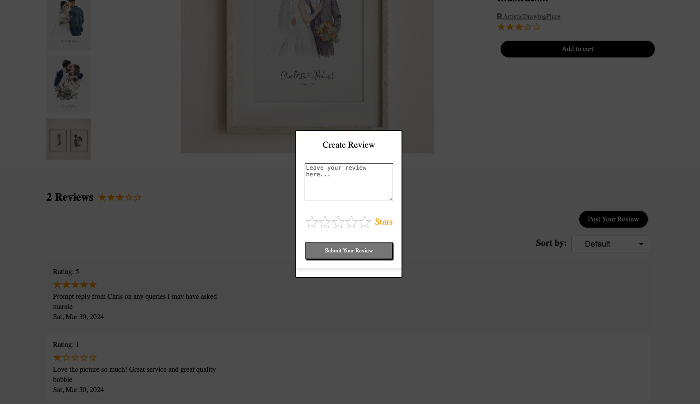
- Add Product to Cart: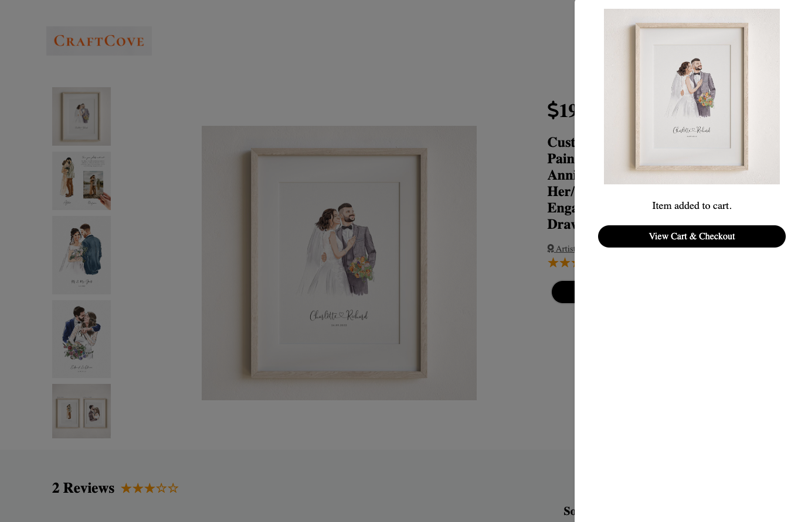
- Shopping Cart: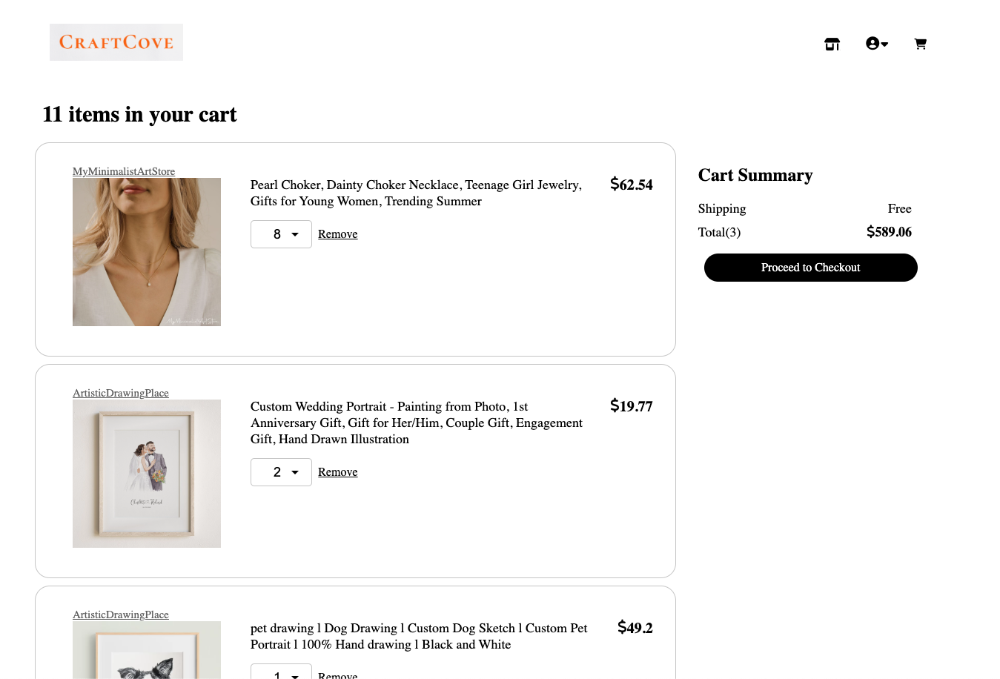
- Shop Page: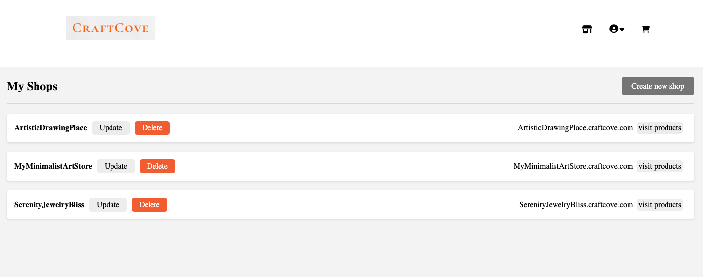
- Product Page: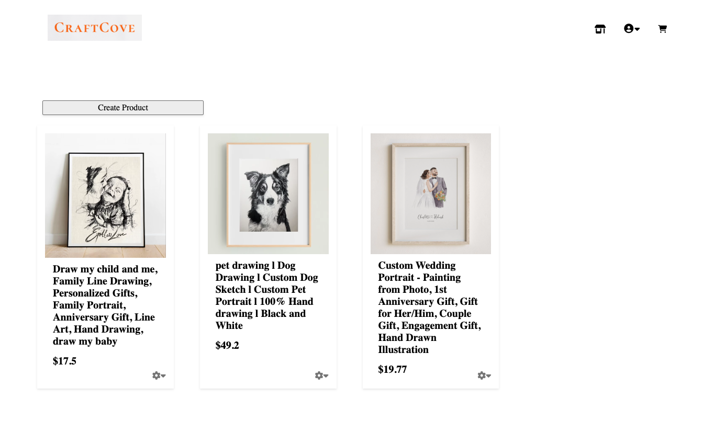
- Create Product Modal: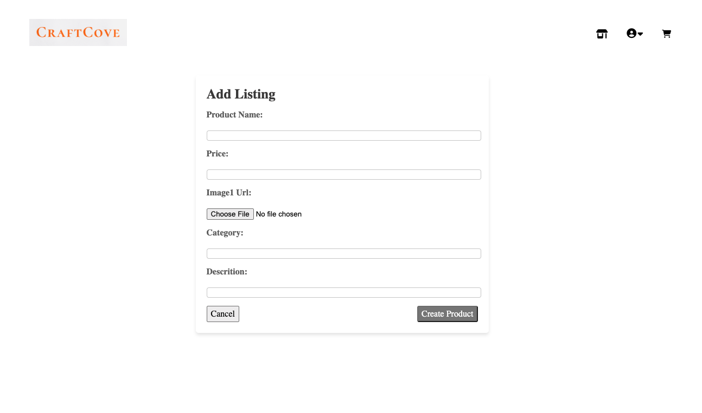
- Update Product: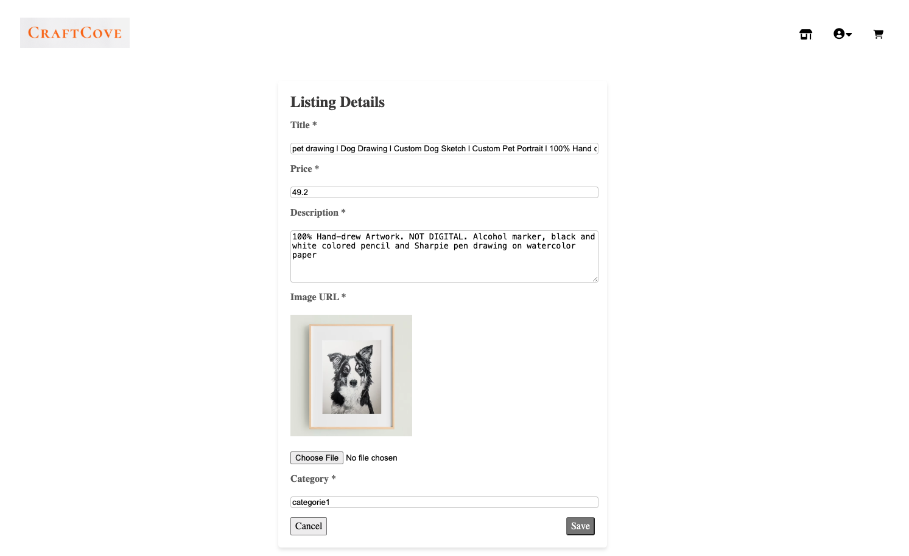
- Delete Product Modal: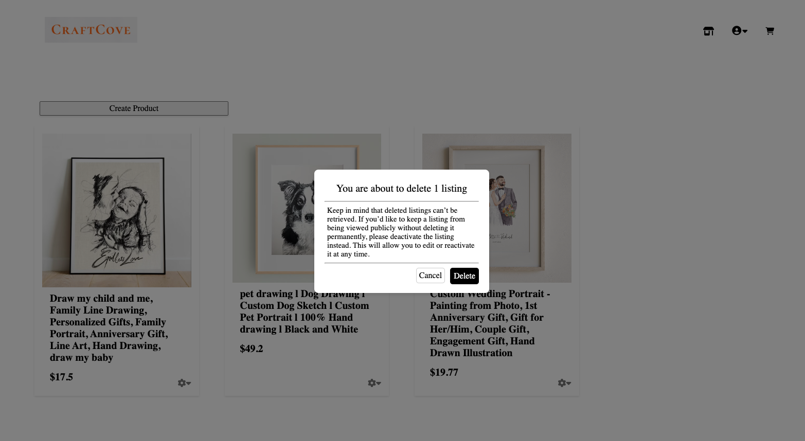

